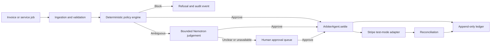

# Arbiter

**A governed payments-agent prototype that keeps deterministic policy between AI reasoning and the payment rail.**

Arbiter processes simulated service-business and accounts-payable workflows. It
checks each proposed payment against explicit rules, sends genuinely ambiguous
cases to a bounded model and human approval path, and exposes one audited
settlement function. Stripe is used in **test mode only**.

Built by **Ben Anokye-Davies** and **Alex Kurkar** for the Nous Research × NVIDIA
× Stripe agent hackathon.

## Why it exists

An agent that can call a payment API should not decide alone whether a payment
is safe. Prompt instructions are not a reliable control boundary for money
movement.

Arbiter separates the responsibilities:

1. **Deterministic policy** blocks unapproved payees, duplicate invoices,
   amount mismatches, changed vendor details and instruction overrides.
2. **Bounded model judgement** uses NVIDIA Nemotron only for cases the fixed
   rules cannot express. The model returns strict JSON and does not receive a
   Stripe tool.
3. **Human escalation** handles cases that remain ambiguous.
4. **One settlement door** runs the full pipeline before any Stripe test-mode
   call.
5. **Append-only evidence** records decisions and payment events for later
   review and reconciliation.

## Architecture



The agent core does not hold the Stripe key. `ArbiterAgent.settle()` is the
single governed path to the payment adapter.

## Example demo scenario

The bundled fixtures can simulate a paid job with a protected margin:

```text
Job value:             GBP 90
Minimum retained:      GBP 40
First delivery spend:  GBP 35  -> approved
Second proposed spend: GBP 45  -> refused because it breaches the margin floor
```

This is a repeatable test-mode scenario, not evidence of a live customer
business or real-money operation.

## Quick start

Requires Python 3.10 or newer.

```bash
python -m venv .venv
# macOS/Linux
source .venv/bin/activate
# Windows PowerShell
# .venv\Scripts\Activate.ps1
python -m pip install --upgrade pip
python -m pip install -e ".[dev,web,stripe,llm,mcp]"
python -m pytest
python -m arbiter.cli --operator
python -m uvicorn arbiter.web.server:app --port 8000
```

Open <http://localhost:8000>. Without external credentials, Stripe and model
calls use offline stubs and the interface states which mode is active.

Optional integrations are configured through environment variables documented
in [`.env.example`](.env.example). Never commit credentials. Stripe keys must
be `sk_test_...` keys.

## Tests

```bash
python -m pytest
python -m pytest --cov=arbiter --cov-report=term
```

On 26 August 2026, the full suite passed with **179 tests** and the coverage
run reported **1,915 statements, 395 missed, 79% coverage** on Python 3.11.
GitHub Actions runs the suite on Python 3.10–3.12 and builds a distribution
with an isolated wheel-install smoke test.

The suite covers policy ordering and payee allowlists, duplicate and
amount-mismatch detection, prompt-injection and red-team cases, single-door
settlement, operator and accounts-payable workflows, invoice ingestion, web
endpoints, Stripe adapter behaviour, reconciliation, audit evidence and policy
replay.

## Safety boundaries

- **Stripe test mode only.** `LiveStripeGlue` refuses non-test secret keys.
- **No direct model-to-payment tool.** Model output is advisory inside the
  governed pipeline.
- **Fail closed.** Unavailable or malformed model responses escalate instead
  of approving.
- **No production claim.** Arbiter is a hackathon prototype, not a regulated
  payment product.
- **No secret material in the repository.** Local environment files are
  ignored.

## Repository layout

```text
arbiter/
  agent/                 bounded model judgement and escalation
  ingest/                invoice extraction and ingestion pipeline
  ledger/                append-only events and reconciliation
  policy/                deterministic rules and configuration
  web/                   FastAPI application and operator interface
  mcp_server.py          governed MCP entry point
  operator.py            simulated service-business workflow
  stripe_glue.py         offline and Stripe test-mode adapters
scenarios/                deterministic JSON fixtures
dashboard/                browser and phone approval surfaces
tests/                    automated test suite
```

## Team attribution

- **Ben Anokye-Davies:** backend policy engine, agent core, ledger, operator
  loop, governed payment flow, tests, demo narrative and submission work.
- **Alex Kurkar:** dashboard and front-end experience, phone approval surface,
  visual demo flow and product presentation polish.

## Contributing and security

See [CONTRIBUTING.md](CONTRIBUTING.md) for local development and verification,
and [SECURITY.md](SECURITY.md) for private reporting guidance. The project is
licensed under the [MIT License](LICENSE).

## Version and releases

`pyproject.toml` is the authoritative package-version source. The current
version is **0.1.0**. There are no Git tags or published package releases in
this repository yet. This cleanup has version impact **none** because it does
not change runtime behavior.
